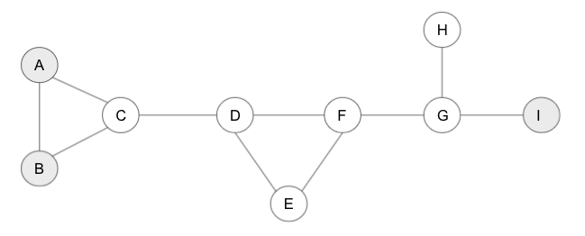
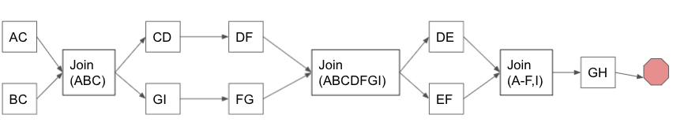

# query_planner
A quick-and-dirty library to create query plans for TRAPI queries.

query_planner is meant to be used as a library.  It consumes TRAPI queries, and produces dependency graphs.

Usage:
```
from generate_plan import generate_plan

TRAPI_Query = TRAPI['message']['query_graph']
plans = generate_plan(TRAPI_Query)
```

`generate_plan` returns a list of `QueryPlan`, each of which handles an independent component of the query graph.  
For instance, if the query graph is not connected, then each component will generate its own independent query 
plan.  Furthermore, bound nodes (nodes with input identifiers) can split the graph into independent sections,
each of which returns its own `QueryPlan`.    The final result of a query will be the cartesian join of results across
the plans returned.

Each `QueryPlan` has a simple interface: 
`QueryPlan.start()` returns a list of edge identifiers for the query graph that kick off the query.
`QueryPlan.get_next(x)` takes a previous event, and returns a list of immediate downstream events
`QueryPlan.get_prevs(x)` takes an event and returns the list of immediate upstream events

An event can be one of three things:
1. A string edge_id from the input query_graph
2. A tuple representing a join operation
3. A TerminalEvent representing the end of a branch.  A terminal event does not mean that the entire query is done,
but only that a particular event has no children.
   
For many queries, such as one-side bound n-hops, each return from a previous edge can move on to the next edge 
asynchronously.  However, for more complicated queries, there are places where the plan requires all upstream work 
to finish, and then prune any outstanding nodes that do not conform to the constraints of the subgraph that has been
completed so far.

For instance, consider A-B-C, B-D   Where A and C are bound.   We first walk the AB and BC edges, but we don't proceed
to BD until ABC is complete.  To know what we need to wait for, we may need to query for the join event's parents, 
which can be done with `QueryPlan.get_prevs(x)`

Example:
Consider a TRAPI query that looks like:

where the grey nodes are bound.  A test case for this query is found in `tests.test_plans.test_readme`.

`generate_plans` returns two independent plans.  One simply queries the AB edge.  Because both A and B are bound, 
no information about the AB edge impacts any other part of the query so it can be done independently.  The other
plan covers the remaining edges.  The returned dependency graph looks like this:



The planner looks for the smallest paths that will induce a constraint on the larger query.   It identifies the ABC
section of the query, and allows AC and BC to run simultaneously.  The Join operation blocks, and only allows C values
that satisfy the joint ABC constraint.  

When this chunk is completed, the query planner identifies the bound linear path CDFGI.  It allows simultaneous querying
from the two sides, until node F is reached, which is another blocking join.  This ends up pruning nodes D, F, and G to
only include results that match the C-I constraint.

Subsequently the E-loop is queried and joined, followed by the dangling H node.

